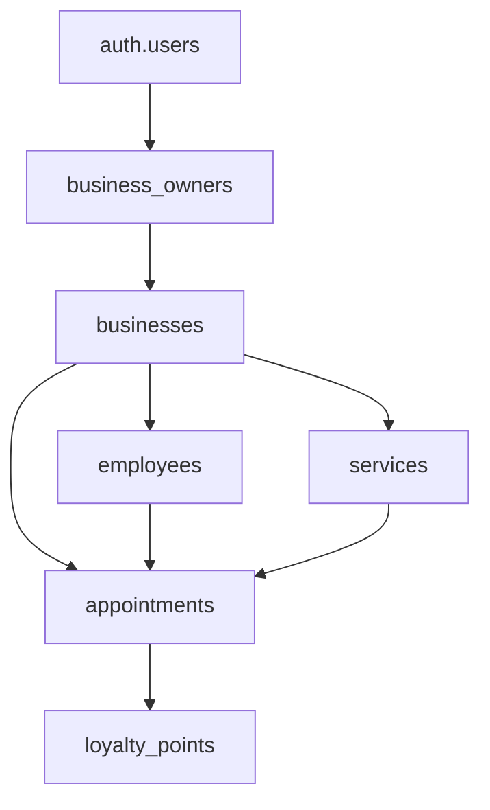

# 🗄️ Base de Datos IRIS

Sistema de base de datos para **IRIS - Sistema de Gestión para Salones de Belleza**.

## 📋 Archivos del Directorio

| Archivo | Descripción | Estado |
|---------|-------------|---------|
| `schema.sql` | **Schema completo** - Todas las tablas según planification.md | ✅ Listo |
| `constraints_simple.sql` | **Constraints críticos** - Solo los esenciales que funcionan | ✅ Usar este |
| `sample_data.sql` | **Datos de ejemplo** - Para testing y desarrollo | ✅ Opcional |
| `README.md` | **Guía completa** - Documentación de la base de datos | 📖 Este archivo |

## 🚀 Setup Paso a Paso en Supabase

### **Paso 1: Crear Proyecto en Supabase**

1. Ve a [supabase.com](https://supabase.com) y crea cuenta
2. Click en **"New Project"**
3. Elige nombre: `iris-salon-management`
4. **Genera contraseña segura** y guárdala
5. Selecciona región más cercana (US East por velocidad)
6. Click **"Create new project"**
7. **Espera 2-3 minutos** hasta que el proyecto esté listo

### **Paso 2: Obtener Credenciales**

1. En el dashboard, ve a **Settings > API**
2. Anota estos valores para tu `.env`:

```bash
# Copiar estos valores EXACTOS de tu proyecto:
SUPABASE_URL=https://[tu-project-id].supabase.co
SUPABASE_KEY=[tu-anon-public-key]
SUPABASE_SERVICE_KEY=[tu-service-role-secret-key]
JWT_SECRET=[tu-jwt-secret]
```

### **Paso 3: Configurar Base de Datos**

#### **3.1 - Ejecutar Schema Principal**

1. Ve a **SQL Editor** en el sidebar
2. Crea nueva query
3. **Copia y pega TODO el contenido** del archivo `schema.sql`
4. Click **"RUN"**
5. ✅ Deberías ver: "Success. No rows returned"

#### **3.2 - Aplicar Constraints Críticos**

1. En el SQL Editor, crea **nueva query**
2. **Copia y pega TODO el contenido** del archivo `constraints_simple.sql`
3. Click **"RUN"**
4. ✅ Deberías ver: "Constraints críticos aplicados correctamente ✅"

#### **3.3 - Insertar Datos de Ejemplo (Opcional)**

1. En el SQL Editor, crea **nueva query**
2. **Copia y pega TODO el contenido** del archivo `sample_data.sql`
3. Click **"RUN"**
4. ✅ Deberías ver: "Success. 57 rows returned" (aproximadamente)

### **Paso 4: Verificar Setup**

#### **4.1 - Verificar Tablas Creadas**

Ejecuta esta query en el SQL Editor:

```sql
-- Verificar que todas las tablas se crearon correctamente
SELECT
    table_name,
    table_type
FROM information_schema.tables
WHERE table_schema = 'public'
AND table_name IN (
    'businesses', 'business_hours', 'services', 'employees',
    'employee_hours', 'appointments', 'special_openings',
    'loyalty_points', 'loyalty_rewards', 'loyalty_redemptions',
    'promotions', 'business_faqs', 'business_owners'
)
ORDER BY table_name;
```

**Resultado esperado:** 13 tablas listadas

#### **4.2 - Verificar Constraint Anti-Overlapping**

```sql
-- Verificar el constraint más importante de IRIS
SELECT
    conname as constraint_name,
    contype as constraint_type,
    pg_get_constraintdef(oid) as definition
FROM pg_constraint
WHERE conname = 'prevent_overlapping_appointments';
```

**Resultado esperado:** 1 fila con el constraint EXCLUDE

#### **4.3 - Verificar Datos de Ejemplo**

```sql
-- Verificar que los datos de ejemplo se insertaron
SELECT
    'businesses' as tabla, COUNT(*) as registros FROM businesses
UNION ALL
SELECT 'services', COUNT(*) FROM services
UNION ALL
SELECT 'employees', COUNT(*) FROM employees
UNION ALL
SELECT 'business_hours', COUNT(*) FROM business_hours;
```

**Resultado esperado:**
- businesses: 2 registros
- services: 8 registros
- employees: 3 registros
- business_hours: 13 registros

### **Paso 5: Configurar Variables de Entorno**

Crea tu archivo `.env` en la raíz del proyecto:

```bash
# === CONFIGURACIÓN DE SUPABASE ===
SUPABASE_URL=https://tu-proyecto-id.supabase.co
SUPABASE_KEY=eyJhbGciOiJIUzI1NiIsInR5cCI6IkpXVCJ9...
SUPABASE_SERVICE_KEY=eyJhbGciOiJIUzI1NiIsInR5cCI6IkpXVCJ9...
JWT_SECRET=tu-jwt-secret-de-32-caracteres-minimo

# === CONFIGURACIÓN OPCIONAL ===
DEBUG=true
LOG_LEVEL=INFO
DEFAULT_TIMEZONE=America/Argentina/Buenos_Aires
```

## 🏗️ Estructura de Datos

### **Tablas Principales**

#### 🏢 **Businesses** (Salones)
- `id` - UUID único del salón
- `name` - Nombre del salón
- `timezone` - Zona horaria (Argentina)
- `is_active` - ON/OFF del salón

#### 👥 **Employees** (Empleados)
- `business_id` - Salón al que pertenece
- `user_id` - Usuario de Supabase Auth (opcional)
- `is_available` - ON/OFF del empleado

#### 💼 **Services** (Servicios)
- `business_id` - Salón al que pertenece
- `price` - Precio en ARS
- `duration_minutes` - Duración del servicio
- `points_awarded` - Puntos de fidelización

#### 📅 **Appointments** (Reservas)
- **CONSTRAINT CRÍTICO**: Previene overlapping appointments
- `start_datetime` / `end_datetime` - Con timezone
- `status` - confirmed, completed, cancelled, no_show
- `is_override` - Para sobreturnos

#### ⭐ **Loyalty System** (Fidelización)
- `loyalty_points` - Historial de puntos
- `loyalty_rewards` - Recompensas canjeables
- `loyalty_redemptions` - Canjes realizados

### **Relaciones Multi-tenant**



## 🔒 Constraints Críticos

### **1. Prevención de Double-Booking**
```sql
-- El constraint MÁS IMPORTANTE de IRIS
EXCLUDE USING gist (
    employee_id WITH =,
    tstzrange(start_datetime, end_datetime) WITH &&
) WHERE (status != 'cancelled' AND is_override = false)
```

### **2. Timezone Consistency**
- Solo timezones válidos de Argentina
- Manejo automático de horarios

### **3. Validación Multi-tenant**
- Empleado y servicio deben ser del mismo business
- Triggers automáticos de validación

## 🧪 Testing y Validación

### **Datos de Ejemplo**
El archivo `sample_data.sql` incluye:
- 2 salones de ejemplo
- Empleados con horarios
- Servicios con precios
- Sistema de recompensas
- Promociones activas
- FAQs básicas

### **Función de Integridad**
```sql
SELECT * FROM validate_system_integrity();
```

Verifica que todos los datos sean consistentes.

## 🌍 Timezone Handling

### **Configuración Argentina**
- **Default**: `America/Argentina/Buenos_Aires`
- **Soportados**: Todas las zonas horarias argentinas
- **Storage**: Todos los timestamps son `TIMESTAMP WITH TIME ZONE`

### **Validación de Horarios**
```sql
SELECT is_within_business_hours('business-id', '2024-01-15 14:00:00+00');
```

## 🔐 Seguridad

### **Row Level Security (RLS)**
- **Estado**: DESHABILITADO por diseño
- **Estrategia**: Validación manual en FastAPI
- **Ventaja**: Mayor control y debugging

### **Multi-tenant**
- Todas las tablas usan `business_id`
- Aislamiento por salón
- Usuarios pueden pertenecer a múltiples salones

## 📊 Performance

### **Índices Críticos**
- `appointments(employee_id, start_datetime)`
- `loyalty_points(business_id, customer_id)`
- `businesses(is_active)`

### **Queries Optimizadas**
- Vista `appointments_full` para consultas complejas
- Vista `loyalty_balances` para saldos de puntos

### **Paso 6: Probar Conexión desde FastAPI**

Una vez que tengas tu `.env` configurado, prueba la conexión:

```bash
# En la terminal, desde la raíz del proyecto:
python -c "from app.config.database import check_connection; import asyncio; print('Conexión:', asyncio.run(check_connection()))"
```

**Resultado esperado:** `Conexión: True`

## 🆘 Troubleshooting

### **❌ Error: "extension uuid-ossp does not exist"**

**Solución:** En Supabase SQL Editor, ejecuta:

```sql
CREATE EXTENSION IF NOT EXISTS "uuid-ossp";
CREATE EXTENSION IF NOT EXISTS "btree_gist";
```

### **❌ Error: "relation does not exist"**

Esto significa que el `schema.sql` no se ejecutó correctamente.

**Verificar:**
```sql
SELECT table_name FROM information_schema.tables
WHERE table_schema = 'public'
ORDER BY table_name;
```

**Solución:** Re-ejecutar `schema.sql` completo

### **❌ Error: "prevent_overlapping_appointments already exists"**

Esto pasa si ejecutas `constraints.sql` dos veces.

**Solución:**
```sql
-- Eliminar constraint existente
ALTER TABLE appointments DROP CONSTRAINT IF EXISTS prevent_overlapping_appointments;

-- Luego re-ejecutar constraints.sql
```

### **❌ Error de JWT Token**

Si FastAPI da error de JWT:

1. Verifica que `JWT_SECRET` en `.env` sea el correcto
2. En Supabase: **Settings > API > JWT Settings**
3. Copia el valor **exacto** de "JWT Secret"

### **❌ FastAPI no conecta a Supabase**

**Debug paso a paso:**

1. **Verificar URL:**
```python
print(f"URL: {os.getenv('SUPABASE_URL')}")
```

2. **Verificar Key:**
```python
print(f"Key: {os.getenv('SUPABASE_KEY')[:20]}...")
```

3. **Test de conexión manual:**
```python
from supabase import create_client
client = create_client(url, key)
result = client.table('businesses').select('*').limit(1).execute()
print("Conexión exitosa:", len(result.data) >= 0)
```

### **❌ Error: "row violates constraint"**

Esto pasa al intentar crear appointments superpuestas (¡el constraint funciona!).

**Verificar conflictos:**
```sql
SELECT
    id, employee_id, start_datetime, end_datetime, status
FROM appointments
WHERE employee_id = 'tu-employee-id'
AND start_datetime >= '2024-01-15'::date
ORDER BY start_datetime;
```

### **❌ Timezone Issues**

Si las horas se ven mal:

```sql
-- Verificar timezone de una cita
SELECT
    start_datetime,
    start_datetime AT TIME ZONE 'UTC' as utc_time,
    start_datetime AT TIME ZONE 'America/Argentina/Buenos_Aires' as local_time
FROM appointments
LIMIT 1;
```

## 🔄 Migrations Futuras

### **Estructura Preparada Para**
- Sistema de inventario
- Multi-sucursal
- Reportes avanzados
- Integración con IA

### **Campos Extensibles**
- `notes` en appointments
- `metadata` JSON en varias tablas
- `display_order` para ordenamiento

## 📞 Soporte

Si tenés problemas con el setup:

1. **Verificá prerrequisitos** (PostgreSQL 14+)
2. **Revisá logs** del SQL Editor
3. **Ejecutá función de integridad**
4. **Verificá variables de entorno**

---

> 💡 **Tip**: Mantené este directorio `/database/` como fuente única de verdad para toda la estructura de datos de IRIS.